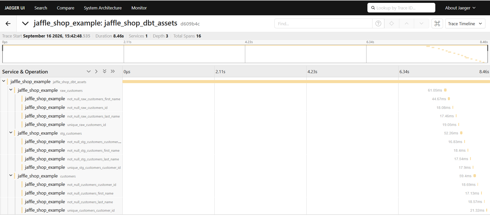
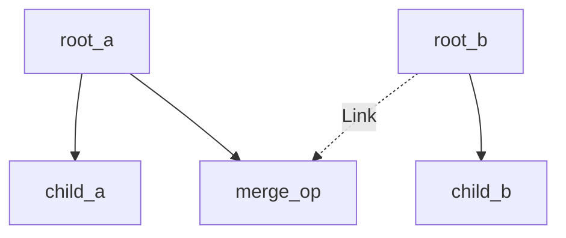

# dagster-otel

[](https://pypi.org/project/dagster-otel/)
[](https://pypi.org/project/dagster-otel/)
[](https://github.com/HirofumiTsuda/dagster-otel/releases/latest)
[](https://github.com/HirofumiTsuda/dagster-otel/actions/workflows/ci.yml)
[](https://github.com/HirofumiTsuda/dagster-otel/actions/workflows/codeql.yml)
[](LICENSE)

OpenTelemetry tracing for Dagster ops and assets -- with trace/span IDs correlated into
your own log lines -- without giving up ownership of your op/asset definitions to a
third-party decorator, and without monkeypatching Dagster internals.

**Status: early release, self-tested locally against real Dagster runs (`multiprocess`,
`k8s_job_executor`, retry-from-failure) + a real trace backend.**


*A real trace from the included example -- `traced_dbt()` turns one opaque
`@dbt_assets` step into a real `step → asset → check` tree.*

## Table of Contents

- [Installation](#installation)
- [Usage](#usage)
- [Configuration](#configuration)
- [Compatibility](#compatibility)
- [Why this exists](#why-this-exists)
- [Contributing](#contributing)
- [License](#license)

## Installation

```sh
pip install dagster-otel
```

## Usage

```python
from dagster import asset, job, op

from dagster_otel import traced

@op(...)                # Dagster's own @op still owns op-ness; @traced() is a thin
@traced()                # layer underneath. No @resource/required_resource_keys, no
def upstream_op(context) -> int:  # manual "root" step -- the first @traced() step to
    ...                            # run in a given run just becomes the root.

@op(...)
@traced()
def downstream_op(context, x: int) -> int:
    ...

@asset(...)
@traced()  # same decorator, works for assets too
def downstream_asset(context) -> None:
    ...

@op(...)
@traced  # bare works too, like @op/@asset themselves -- same as @traced()
def another_op(context) -> None:
    ...

@job(...)
def my_job():
    downstream_op(upstream_op())
```

Works across Dagster's `multiprocess` and `k8s_job_executor` executors: each step
usually runs in its own process, sometimes on its own node, so trace context is
propagated via Dagster's own run storage rather than in-process memory. See
[docs/design.md](docs/design.md) for how, and what's verified vs. still assumed.

The actual trace shape for a multi-root, fan-in graph (`root_a`/`root_b` independent,
`merge_op` depending on both) -- verified against real Dagster + Jaeger, not just
drawn for illustration:



`merge_op` gets a real parent (`root_a`, deterministic) plus a `Link` to the other
dependency it can't have as a second parent -- both relationships stay visible on
the span, not just whichever upstream happened to be found first.

For `@dbt_assets`, `dagster_otel.dbt.traced_dbt()` is a drop-in replacement for
`@traced()` that additionally opens a child span per dbt node (model/seed/test),
keyed by the real Dagster asset_key/check_name -- no changes needed to the function
body:

```python
from dagster_otel.dbt import traced_dbt

@dbt_assets(manifest=...)
@traced_dbt()
def my_dbt_assets(context, dbt: DbtCliResource):
    yield from dbt.cli(["build"], context=context).stream()
```

In Jaeger, that's a real `step → asset → check` tree, not one opaque span for the
whole `dbt build` -- see the screenshot at the top of this README (the real
jaffle_shop example: 16 spans, 1 step + 3 assets + 12 checks), each with the
accurate duration dbt itself measured.

## Configuration

Standard OTel environment variables -- nothing bespoke:

| Variable | Purpose |
| --- | --- |
| `OTEL_SERVICE_NAME` | Names your service in the trace backend. |
| `OTEL_EXPORTER_OTLP_ENDPOINT` (or `..._TRACES_ENDPOINT`) | Where to send spans (e.g. `http://localhost:4317`). Required -- without one of these set, no real exporter is attached at all (see below). |
| `OTEL_EXPORTER_OTLP_TRACES_TIMEOUT` / `..._TIMEOUT` | Per-export timeout. Set this yourself if the default (2s) doesn't fit -- see [docs/design.md](docs/design.md) for why a default exists at all (an unreachable collector otherwise blocked every step for ~7s). |
| `OTEL_EXPORTER_OTLP_TRACES_PROTOCOL` / `..._PROTOCOL` | Transport to export over: `grpc` (default) or `http/protobuf` -- e.g. for a collector that only exposes HTTP ingest, or an environment that blocks gRPC egress. Any other value raises rather than silently keeping gRPC. |
| `OTEL_SDK_DISABLED` | Set to `true` to force no export regardless of the endpoint vars above. |

`@traced()` reads these itself (idempotently) the first time it runs in a process --
there's nothing else to wire up, no `@resource`/`required_resource_keys` needed. Call
`configure()` yourself only if you want configuration to happen eagerly (e.g. at
`Definitions` load time) rather than lazily on first use.

Without `OTEL_EXPORTER_OTLP_ENDPOINT`/`..._TRACES_ENDPOINT` set, no real OTLP exporter
is created at all -- spans are still created (propagation and log correlation keep
working), just never sent anywhere, so trying `@traced()` with zero setup never makes
a surprise network call. See [docs/design.md](docs/design.md) for the one deliberate
tradeoff this makes.

Nesting a whole run's trace under an external caller's (a CI/CD pipeline, a
scheduler, another OTel-instrumented system) is a run tag, not an env var -- set
`EXTERNAL_TRACE_CONTEXT_TAG_KEY` (exported from `dagster_otel`) at launch time:

```python
from dagster_otel import EXTERNAL_TRACE_CONTEXT_TAG_KEY

carrier: dict[str, str] = {}
TraceContextTextMapPropagator().inject(carrier)  # from your own active span
my_job.execute_in_process(tags={EXTERNAL_TRACE_CONTEXT_TAG_KEY: json.dumps(carrier)})
```

Every root step in the run (the ones that would otherwise seed a fresh trace) checks
for this tag first. See [docs/design.md](docs/design.md) for the full verification.

### Trace backends checked

No backend-specific code exists here -- `configure()` constructs `OTLPSpanExporter()`
with no `endpoint=`/`headers=`/`credentials=`, so anything speaking OTLP should work
purely via the env vars above. What's actually been checked end-to-end, not just
assumed to work by construction:

| Backend | License | Status |
| --- | --- | --- |
| Jaeger | Apache-2.0 | ✅ Verified -- `multiprocess`/`k8s_job_executor`/retry-from-failure/`traced_dbt()`/external trace context, see [docs/design.md](docs/design.md) |
| Grafana Tempo | AGPL-3.0 | ✅ Verified -- real `@dbt_assets` jaffle_shop pipeline, through a real OTel Collector (not sent directly), see [docs/design.md](docs/design.md) |
| SigNoz | MIT | ⬜ Not yet -- [#43](https://github.com/HirofumiTsuda/dagster-otel/issues/43) |

Should work the same way against any other OTLP-compatible backend (Honeycomb,
Datadog, New Relic, ...) -- just not individually checked off here yet. [Open an
issue](https://github.com/HirofumiTsuda/dagster-otel/issues/new/choose) if you hit
something backend-specific.

### Combined demo: this project + dagster-prometheus-exporter

`docker compose up -d` also starts a full traces-and-metrics demo: this project's
traces and [dagster-prometheus-exporter](https://github.com/HirofumiTsuda/dagster-prometheus-exporter)'s
metrics, both flowing through the same real OTel Collector into Grafana
(`http://localhost:3002`, both Prometheus and Tempo datasources provisioned, plus a
pre-built "dagster-otel combined demo" dashboard) -- see
[examples/README.md](examples/README.md#combined-demo-traces--dagster-prometheus-exporters-metrics-in-grafana)
for how to run the example pipeline against it. The exporter needs zero changes; it's
referenced as an external published image, not vendored here. See
[docs/design.md](docs/design.md) for the full verification writeup.

## Compatibility

Built and verified against **Dagster 1.13.22** and **`opentelemetry-sdk` 1.44.0**
(`pyproject.toml`/`uv.lock`) -- this is the combination every behavior described here
has actually been checked against, including the `multiprocess`/`k8s_job_executor`/
retry-from-failure verification in [docs/design.md](docs/design.md). `pyproject.toml`
declares a much wider floor (`dagster >= 1.5`) since nothing here relies on
version-specific Dagster internals beyond what's documented as an accepted-risk
private-API dependency there -- but that wide range isn't individually spot-checked
the way it is for [dagster-prometheus-exporter](https://github.com/HirofumiTsuda/dagster-prometheus-exporter#compatibility).
If you hit an incompatibility on another version, please
[open an issue](https://github.com/HirofumiTsuda/dagster-otel/issues/new/choose).

Requires Python 3.10+ (matches Dagster's own floor).

## Why this exists

See [docs/design.md](docs/design.md) for the full rationale, including a comparison
against prior art ([formenergy-observability](https://github.com/Form-Energy/formenergy-observability),
a monkeypatch-based prototype) and the design decisions (no monkeypatching, decorators
stack under Dagster's own `@op`/`@asset` rather than replacing it, log correlation via
a public `logging.Filter` on `context.log`).

## Contributing

See [CONTRIBUTING.md](CONTRIBUTING.md) for how to set up your toolchain, run checks
locally, and submit a pull request. Bug reports and feature requests go through
[GitHub issues](https://github.com/HirofumiTsuda/dagster-otel/issues/new/choose); a
security vulnerability goes to [SECURITY.md](SECURITY.md) instead.

## License

MIT -- see [LICENSE](LICENSE).
