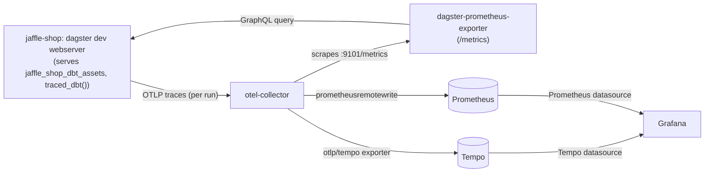
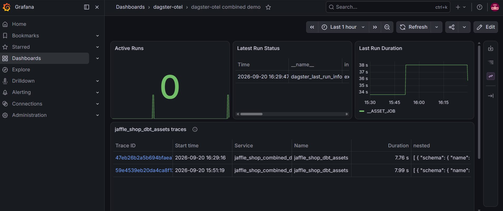
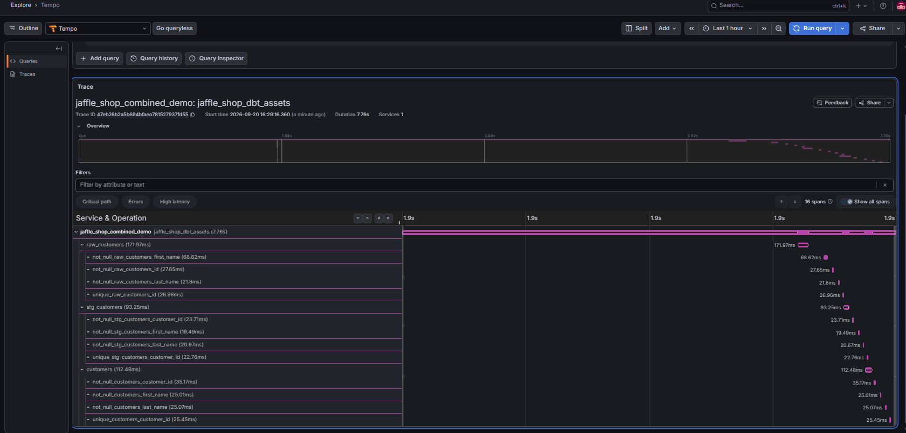

# examples

Not sample code to read -- a real, runnable Dagster pipeline used to verify
`dagster-otel` against something more real than the hand-written toy ops/assets in
`tests/`. See [Issue #2](https://github.com/HirofumiTsuda/dagster-otel/issues/2) for
why this exists.

`jaffle_shop/` is a small hand-written dbt project (seed → staging model → mart
model), copied from
[`dagster-prometheus-exporter`](https://github.com/HirofumiTsuda/dagster-prometheus-exporter)'s
dev fixture of the same name (same author, same license, not vendored from anywhere
else -- see `jaffle_shop/README.md` for its own attribution notes).
`dagster_workspace/definitions.py` wraps its `@dbt_assets` function with
`traced_dbt()` (`dagster_otel.dbt`, see [Issue #8](https://github.com/HirofumiTsuda/dagster-otel/issues/8))
-- a child span per dbt node, not just one span for the whole step.

## Setup

```sh
uv sync --group dbt
```

Generate the dbt manifest once (`dagster dev` does this automatically via
`DbtProject.prepare_if_dev()`, but a one-shot `dagster asset materialize` run does
not -- see the comment in `dagster_workspace/definitions.py`). `profiles.yml` reads
`DAGSTER_HOME` (must be set and exist):

```sh
mkdir -p /tmp/dagster-otel-jaffle-shop
cd examples/jaffle_shop && DAGSTER_HOME=/tmp/dagster-otel-jaffle-shop uv run --project .. dbt parse --profiles-dir .
```

## Running

A local Jaeger with OTLP ingest is enough to see the result -- `docker compose up -d`
from the repo root starts one (see the top-level `docker-compose.yaml`).

```sh
DAGSTER_HOME=/tmp/dagster-otel-jaffle-shop \
OTEL_SERVICE_NAME=jaffle_shop_example \
OTEL_EXPORTER_OTLP_ENDPOINT=http://localhost:4317 \
uv run dagster asset materialize -f examples/dagster_workspace/definitions.py --select '*'
```

Open http://localhost:16686, select the `jaffle_shop_example` service, and you
should see a `jaffle_shop_dbt_assets` span with one child span per dbt node
(`raw_customers`, `stg_customers`, `customers`, each with their own dbt test spans
nested underneath) -- confirmed real, accurate durations per node, not zero-width
markers (see Issue #8 / `docs/design.md`).

A separate `customers_row_count_check` span, alongside it -- a genuinely
Dagster-native `@asset_check` (not a dbt test), plain `@traced()` (not
`@traced_dbt()`), verifying `AssetCheckExecutionContext` support (Issue #72):
its own `dagster.asset_check_keys` attribute (`customers:customers_row_count_check`),
not `dagster.asset_keys` -- a different context shape from `@op`/`@asset`, see
`docs/design.md` for the full writeup.

### Against Grafana Tempo instead (through a real OTel Collector)

`docker compose up -d` also starts `tempo` and `otel-collector` (Issue #42) -- point
at the Collector, not Tempo directly, since that's the real deployment shape this
verifies:

```sh
DAGSTER_HOME=/tmp/dagster-otel-jaffle-shop \
OTEL_SERVICE_NAME=jaffle_shop_example \
OTEL_EXPORTER_OTLP_ENDPOINT=http://localhost:4327 \
uv run dagster asset materialize -f examples/dagster_workspace/definitions.py --select '*'
```

Tempo has no UI of its own to click through -- query its API instead:

```sh
curl -s --get http://localhost:3200/api/search --data-urlencode 'q={}' | python3 -m json.tool
```

Find the trace with `serviceStats.jaffle_shop_example.spanCount: 16`, then
`curl http://localhost:3200/api/traces/<traceID>` for the full span tree (same
`step -> asset -> check` shape as the Jaeger case above, see `docs/design.md`).

### Combined demo: traces + dagster-prometheus-exporter's metrics, in Grafana



Two independent pipelines share the same Collector: traces flow straight through
(OTLP receiver -> `otlp/tempo` exporter), while metrics get pulled from the
exporter's `/metrics` (the Collector's `prometheus` receiver scrapes it, same as a
standalone Prometheus server would) and pushed onward via `prometheusremotewrite`
-- see `dev/otel-collector-config.yaml` and `docs/design.md` for why metrics don't
just flow through Prometheus's own scraping instead.

`docker compose up -d` also starts `jaffle-shop` (this same pipeline, but as a
persistent `dagster dev` webserver rather than a one-shot `dagster asset
materialize`), `exporter` (dagster-prometheus-exporter, pointed at that webserver),
`prometheus`, and `grafana` (Issue #56). Trigger a real run via GraphQL instead of
the CLI, since that's what a live webserver is for:

```sh
curl -s -X POST http://localhost:3001/graphql -H 'Content-Type: application/json' -d '{
  "query": "mutation($e: ExecutionParams!) { launchPipelineExecution(executionParams: $e) { __typename ... on LaunchRunSuccess { run { runId status } } ... on PythonError { message } } }",
  "variables": {"e": {"selector": {"repositoryLocationName": "definitions.py", "repositoryName": "__repository__", "jobName": "__ASSET_JOB"}, "mode": "default"}}
}'
```

Open Grafana at http://localhost:3002 (no login needed, anonymous admin) -- the
Tempo datasource shows this run's trace exactly as above, and the Prometheus
datasource shows `dagster_last_run_info{status="success"}` and every other metric
`dagster-prometheus-exporter` produces, both sourced from this one run. The
exporter's own `/metrics` is scraped by the Collector's `prometheus` receiver (not
by Prometheus directly), then forwarded via `prometheusremotewrite` -- see
`docs/design.md` for why, and for the "Tempo's search index lags ingestion by a few
seconds" gotcha that also applies here.


*Metrics and traces from the same runs, side by side in one dashboard. The traces
panel is a table (not Grafana's native traces panel) -- the underlying TraceQL
**search** query matches multiple traces, which Tempo itself returns as
table-shaped data (`preferredVisualisationType: "table"`); the native traces panel
only renders a single trace's span tree. Click a Trace ID to drill into the full
waterfall.*


*The same `step -> asset -> check` span tree as the Jaeger example above, this time
via Tempo.*

### Log correlation

`capturing_logger` in `definitions.py` needs to be explicitly selected via run
config, same as any custom `@logger` (confirmed: `Definitions(loggers=...)` alone
isn't enough to activate one for `dagster asset materialize`, matching how
`logger_defs` works for `@job`s -- relevant to
[dagster-io/dagster#12495](https://github.com/dagster-io/dagster/discussions/12495)):

```yaml
# run_config.yaml
loggers:
  capturing_logger: {}
```

```sh
DAGSTER_OTEL_EXAMPLE_LOG_CAPTURE=/tmp/jaffle_shop_captured.log \
DAGSTER_HOME=/tmp/dagster-otel-jaffle-shop \
OTEL_SERVICE_NAME=jaffle_shop_example \
OTEL_EXPORTER_OTLP_ENDPOINT=http://localhost:4317 \
uv run dagster asset materialize -f examples/dagster_workspace/definitions.py --select '*' \
  --config run_config.yaml
```

`/tmp/jaffle_shop_captured.log` should show `trace_id`/`span_id` in `extra` on every
line, including dbt's own progress messages ("Running dbt command...") -- those
route through `get_dagster_logger()`, not `context.log` directly, which is why
`traced()` filters both (see `_tracing.py`).
